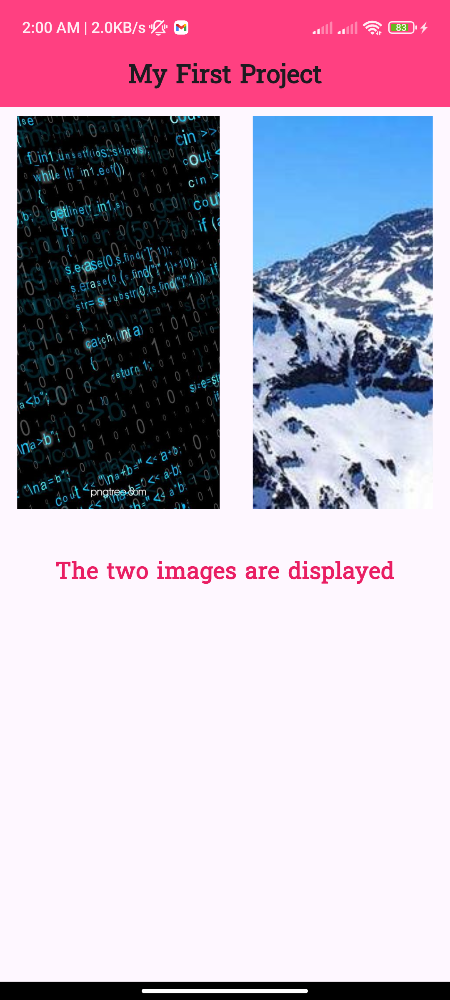

## Stateless Task2

## Project Description

This Flutter project represents the creation of a **Stateless Widget** that:

- Displays a title in an `AppBar`.
- Shows **two images** (one loaded from assets and another from the internet) in a row with a gap.
- Adds customized text below the images with a unique font, size, color, family, and bold styling.
- Centers all content on the page with proper spacing.

---

## Features

1. **Title**: A title at the top of the page displayed using `AppBar`.
2. **Images**:
    - One image is loaded from local assets.
    - Another image is loaded from the internet.
3. **Custom Text**:
    - Displays a message: `"The two images are displayed"`.
    - Customized font: `Suwannaphum-Regular`.
    - Text is bold, pink, and styled with proper font size.

---

## How to Run

1. Clone the repository.
2. Run `flutter pub get` to fetch dependencies.
3. Execute the app on an emulator or a real device.

## Screenshot




## Code Structure

- `main.dart`: Initializes the app.
- `my_stateless_widget.dart`: Contains the main stateless widget logic.

## File Structure

```
stateless_task2/
├── lib/
│   ├── main.dart                 # Main entry point of the app
│   └── my_stateless_widget.dart  # Contains the Stateless Widget logic
├── assets/
│   ├── images/
│   │   └── Programming.jpg       # Local image used in the app
│   └── fonts/
│       └── Suwannaphum-Regular.ttf # Custom font file
├── pubspec.yaml                  # Dependencies and assets configuration
├── README.md                     # Project documentation
├── create.png                    # Create screenshot
└── output.png                    # Output screenshot

```
